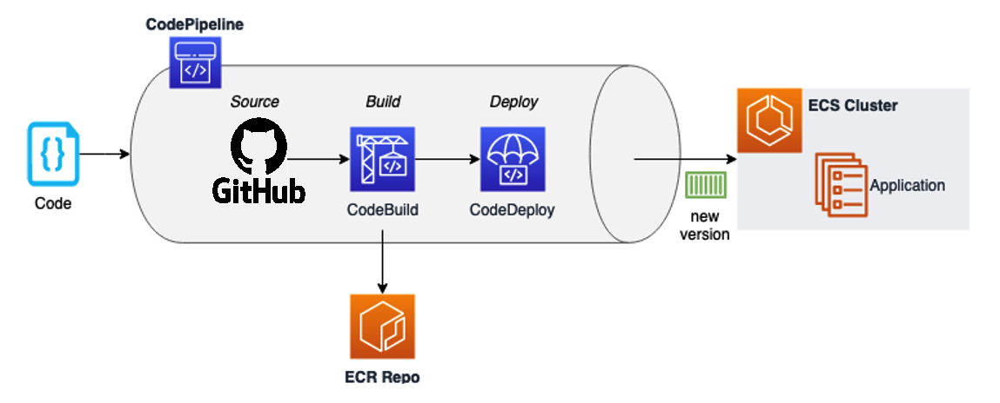

# AWS DevOps Workshop Reference

Personal reference repository from AWS DevOps Workshop covering CI/CD pipeline with ECS, CodePipeline, and Blue/Green deployments.

## Workshop Overview

This workshop demonstrates implementing a DevOps model using AWS services to deploy a containerized web application. Key components include:

- **Container Orchestration**: Amazon ECS with Fargate
- **CI/CD Pipeline**: CodePipeline, CodeBuild, CodeDeploy  
- **Deployment Strategy**: Blue/Green deployment with traffic shifting
- **Infrastructure**: Application Load Balancer, ECR, VPC setup

**Duration**: 2-4 hours | **Cost**: AWS Free Tier eligible

## Workshop Steps

1. [Environment Setup](docs/01-setup.md) - IDE configuration, AWS CLI, Docker setup
2. [GitHub Integration](docs/02-github-integration.md) - Repository setup, CodeConnection, tokens
3. [Build Configuration](docs/03-build-configuration.md) - Dockerfile, buildspec.yml, ECR setup
4. [Deployment Configuration](docs/04-deployment-config.md) - AppSpec, task definitions, CodeDeploy
5. [Pipeline Creation](docs/05-pipeline-creation.md) - Complete CI/CD pipeline assembly
6. [Testing Pipeline](docs/06-testing-pipeline.md) - Code changes, deployment validation
7. [Cleanup](docs/07-cleanup.md) - Resource removal and cleanup

## Repository Contents

- Configuration files are at repository root
- Detailed documentation in `docs/` folder
- Workshop images in `img/` folder
- Sample web application: `index.html`