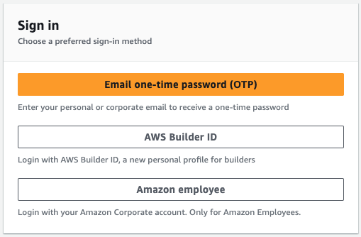
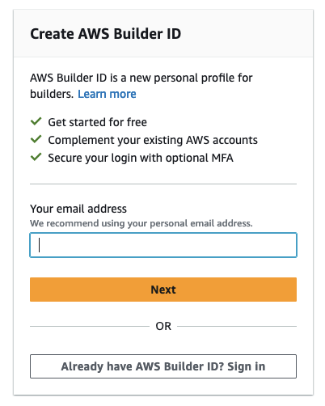
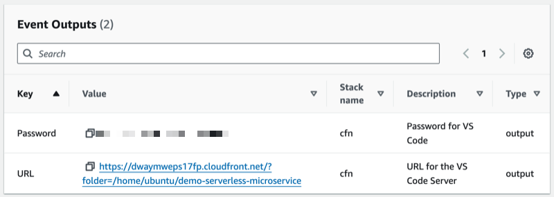
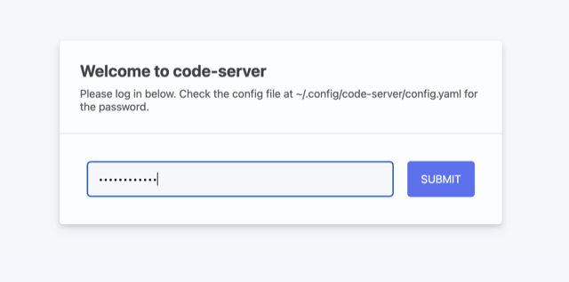
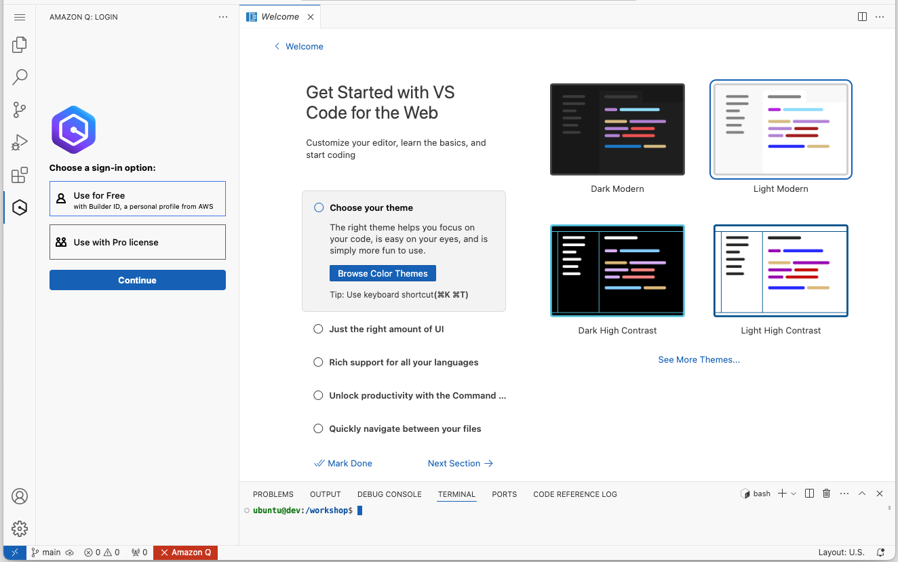
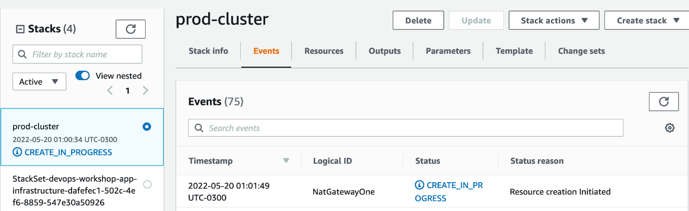
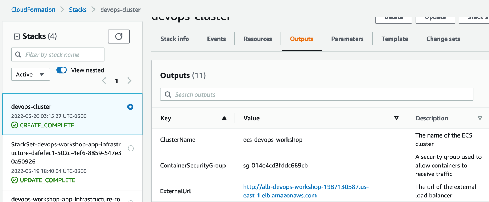
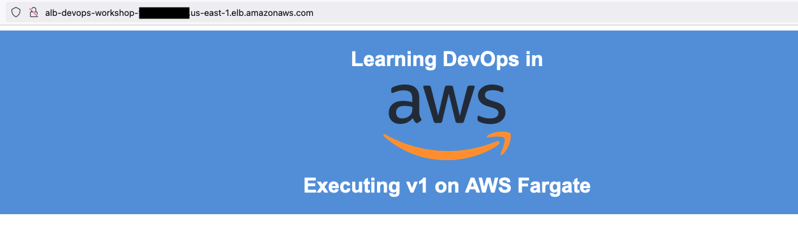

# Environment Setup

This section covers the initial environment setup and prerequisites for the AWS DevOps Workshop.

## Prerequisites

Before moving forward, ensure you have:
- Selected one of the supported regions (see Regions section below)
- Not reached the maximum VPC limits in your AWS account
- Basic understanding of DevOps and CI/CD concepts (recommended but not required)

## Supported Regions

This workshop can only be implemented in the following regions:

- US East (North Virginia): `us-east-1`
- US East (Ohio): `us-east-2`
- US West (Northern California): `us-west-1`
- US West (Oregon): `us-west-2`
- Asia Pacific (Hong Kong): `ap-east-1`
- Asia Pacific (Seoul): `ap-northeast-2`
- Asia Pacific (Singapore): `ap-southeast-1`
- Asia Pacific (Sydney): `ap-southeast-2`
- Asia Pacific (Tokyo): `ap-northeast-1`
- Canada (Central): `ca-central-1`
- Europe (Frankfurt): `eu-central-1`
- Europe (Ireland): `eu-west-1`
- Europe (London): `eu-west-2`
- Europe (Milan): `eu-west-3`
- Europe (Paris): `eu-west-3`
- Europe (Stockholm): `eu-north-1`
- South America (Sao Paulo): `sa-east-1`

## IDE Setup (AWS Events Only)

**Note**: This step is only necessary if you run this workshop as part of an AWS event. If you do it on your own account, you can use your own IDE locally.

### Accessing Visual Studio code-server

1. Open the Workshop Studio event dashboard
2. Choose your preferred sign-in method (AWS Builder ID for guided events)



3. Create AWS Builder ID if needed:



4. Enter the event access code shared by the organizer
5. Navigate to the Event Outputs pane and copy the Password



6. Access the VS Code URL and enter the password



7. You should see the VS Code IDE:



The following items are pre-installed on VS code-server:
- Amazon Q Developer for VSCode
- Git
- Python

## Environment Configuration

### Set AWS Region

Set the `AWS_DEFAULT_REGION` variable:

```bash
echo 'export AWS_DEFAULT_REGION=us-east-1' >> ~/.bashrc
source ~/.bashrc
```

### Docker Setup

You may need to set up Docker access. If prompted for a password:

1. Enter root mode: `sudo su`
2. Change participant user password: `passwd participant`
3. Exit root: `exit`
4. Add user to Docker group:
   ```bash
   newgrp docker
   sudo usermod -aG docker $USER
   ```

### Initial Infrastructure Setup

Execute the setup script to create the required infrastructure:

```bash
# Download setup files
curl -o setup.zip 'https://static.us-east-1.prod.workshops.aws/f0a47725-0fce-4c49-87b8-367c998499f6/static/downloads/setup.zip?Key-Pair-Id=K36Q2WVO3JP7QD&Policy=eyJTdGF0ZW1lbnQiOlt7IlJlc291cmNlIjoiaHR0cHM6Ly9zdGF0aWMudXMtZWFzdC0xLnByb2Qud29ya3Nob3BzLmF3cy9mMGE0NzcyNS0wZmNlLTRjNDktODdiOC0zNjdjOTk4NDk5ZjYvKiIsIkNvbmRpdGlvbiI6eyJEYXRlTGVzc1RoYW4iOnsiQVdTOkVwb2NoVGltZSI6MTc2MTQwNjI0NX19fV19&Signature=g4Ym2zdm35jYhjvm~kEvPmJkwtapyIrvs~5WXWZRohlMzp91K-11UQzgO2glM5NtwLhbwCA7Wvzp0BPoKJCqjkIDh4JMv6c6GmYj0tmnscb21dZP5pRo5yFOeeF1sQUIG~9dO5E~2VQ15i6pkFdhMyXuEQT6FGMnAfIEv~F3ogsp~zTaQO9OF-HMfe-sDiPGKfHRlZA2j73-JRRdPTmLj~xVBA6nxkrVCyN9H3cnG~Hywe0x0hRH62eHkVbsC6fT~d4ugeQUM9FRx8Am-mEt2o2ruYEnf5J9F96w0p28m2-1lXHmurOzWSEH~evvpUq390tSd36Fa51XaqVOd0Xvrg__'
unzip setup.zip

# Navigate to setup directory and run
cd setup/
chmod +x setup.sh
./setup.sh
```

The setup script will:
- Install required tools and set environment variables
- Create initial IAM roles
- Create ECR repository and push sample container image
- Create ECS cluster with Fargate
- Deploy Application Load Balancer (ALB)
- Set up networking (VPC, subnets, NAT Gateway, route tables, security groups)
- Deploy sample application

### Validation

After setup completion:
1. Go to CloudFormation console to monitor progress



2. Wait for `devops-cluster` stack to reach `CREATE_COMPLETE` status



3. Access the application URL from CloudFormation Outputs tab
4. Verify the simple web page loads successfully



The deployed infrastructure includes:
- ECS Cluster
- Task Definition
- Service running 2 tasks
- Application Load Balancer with listeners and target groups

## Cost and Cleanup

- **Cost**: All resources are covered by AWS Free Tier
- **Cleanup**: All resources will be cleaned up at the end of the workshop

You are now ready to proceed with the DevOps pipeline implementation!