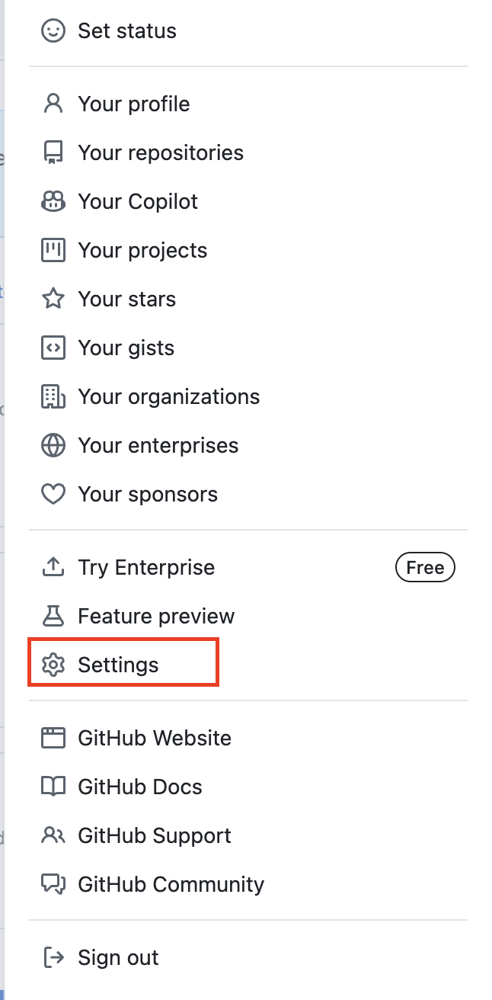

# GitHub Integration

This section covers setting up GitHub repository, tokens, and AWS CodeConnection for the CI/CD pipeline.

## Create GitHub Repository

### Repository Setup

1. Navigate to [GitHub](https://github.com) and sign in or sign up


2. Click **New** to create a new repository


3. Configure repository settings:
   - **Repository name**: `workshop-repo` (or your preferred name)
   - **Visibility**: Public
   - Leave other settings as default


4. Click **Create repository**
5. Copy the GitHub repository URL for later use


### Get GitHub Personal Access Token

1. Go to GitHub settings (top right corner of GitHub)



2. Navigate to **Developer Settings**


3. Select **Personal access tokens** → **Tokens (classic)**


4. Click **Generate new token (classic)**


5. Configure token settings:
   - **Note**: Descriptive name for the token
   - **Expiration**: Set appropriate expiration
   - **Scopes**: Select required permissions for repository access


6. Click **Generate token**
7. **Important**: Copy and save the token immediately (you won't see it again)


## Clone and Setup Local Repository

### Clone Repository

```bash
cd /Workshop
git clone https://github.com/[USERNAME]/workshop-repo.git
```

You should see: `warning: You appear to have cloned an empty repository`

### Upload Application Code

Copy the sample application files to your repository:

```bash
cp /Workshop/setup/SampleApp/index.html /Workshop/setup/SampleApp/AWS_logo.png /Workshop/workshop-repo/
```

Your local repository should now look like this:


### Initial Commit

```bash
cd /Workshop/workshop-repo
git checkout -b main
git add *
git commit -m "Initial Commit"
git push -u origin main
```

**Note**: When pushing, you'll need to provide your GitHub username and the token you created earlier.

## Create AWS CodeConnection

AWS CodeConnections integrates with GitHub and enables AWS services to access your repositories securely.

### Benefits of GitHub Apps over Personal Tokens

- Not tied to specific user accounts
- Use short-lived tokens (hours, not permanent)
- Repository-specific access control
- Higher API rate limits

### Create CodeConnection

1. Open AWS Management Console and navigate to:
   **Developer Tools** → **Settings** → **Connections**

2. **Important**: Ensure you're in the correct region (e.g., `us-east-1`)

3. Click **Create connection**

4. Configure connection:
   - **Provider**: GitHub
   - **Connection name**: `github-connection`
   - Click **Connect to GitHub**


### Authorize GitHub Integration

1. Click **Connect** (access request page may appear)
2. Choose **Authorize AWS Connector for GitHub**


3. Under **App Installation**, choose **Install a new app**


4. Select the GitHub account where you want to install the app


5. Configure repository access:
   - Choose **Only select repositories**
   - Select your workshop repository
   - Review permissions


6. Click **Install & Authorize**
7. If prompted, use GitHub MFA to confirm access
8. Select **Authorize AWS Connector for GitHub**


9. Back in AWS console, click **Connect**

### Verification

Your connection should now show:
- Status: **Available**
- Assigned ARN
- Connection ID


## Repository Structure

After completing this section, your repository should contain:
- `index.html` - Sample web application
- `AWS_logo.png` - Application logo
- Git configuration with main branch

## Next Steps

Your GitHub integration is now complete. The CodeConnection will be used in the CI/CD pipeline to automatically trigger builds when code is pushed to the repository.

Proceed to [Build Configuration](03-build-configuration.md) to set up Docker and build specifications.