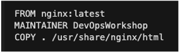
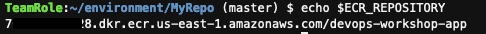
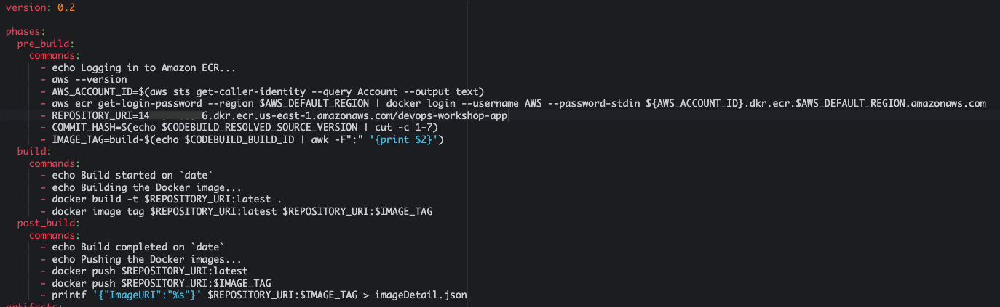
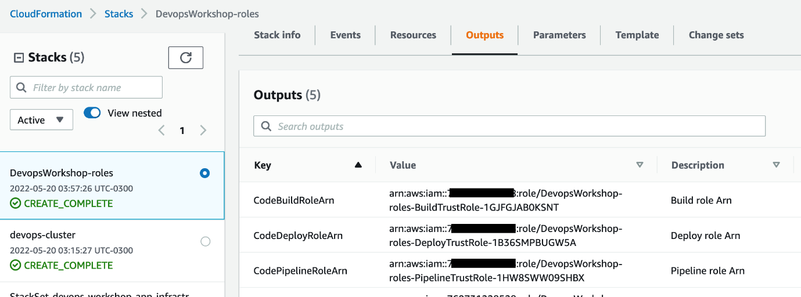

# Build Configuration

This section covers creating Docker configuration and build specifications for the CI/CD pipeline.

## Container Definition

### Create Dockerfile

The Dockerfile defines how to build the container image for your application.

1. Copy the Docker configuration to your repository:
   ```bash
   cp /Workshop/setup/SampleApp/Dockerfile /Workshop/workshop-repo/
   ```

2. Inspect the Dockerfile content:
   ```bash
   cat /Workshop/workshop-repo/Dockerfile
   ```

The Dockerfile uses nginx as the base image and copies web application files to the nginx default route:



3. Commit the Dockerfile:
   ```bash
   cd /Workshop/workshop-repo
   git add Dockerfile
   git commit -m "Adding Docker configuration file"
   git push -u origin main
   ```

## Build Specification

A build spec (`buildspec.yml`) is a YAML file that defines build commands and settings for AWS CodeBuild.

### Get ECR Repository URI

First, get your Amazon ECR repository URI:

```bash
export AWS_ACCOUNT_ID=$(aws sts get-caller-identity --query Account --output text)
export ECR_REPOSITORY=$AWS_ACCOUNT_ID.dkr.ecr.$AWS_DEFAULT_REGION.amazonaws.com/devops-workshop-app
echo $ECR_REPOSITORY
```



### Create buildspec.yml

1. Create the build specification file:
   ```bash
   touch /Workshop/workshop-repo/buildspec.yml
   ```

2. Copy the following content, replacing `<REPO_URI>` with your ECR repository URI:

```yaml
version: 0.2

phases:
  pre_build:
    commands:
      - echo Logging in to Amazon ECR...
      - aws --version
      - AWS_ACCOUNT_ID=$(aws sts get-caller-identity --query Account --output text)
      - aws ecr get-login-password --region $AWS_DEFAULT_REGION | docker login --username AWS --password-stdin ${AWS_ACCOUNT_ID}.dkr.ecr.$AWS_DEFAULT_REGION.amazonaws.com
      - REPOSITORY_URI=<REPO_URI>
      - COMMIT_HASH=$(echo $CODEBUILD_RESOLVED_SOURCE_VERSION | cut -c 1-7)
      - IMAGE_TAG=build-$(echo $CODEBUILD_BUILD_ID | awk -F":" '{print $2}')
  build:
    commands:
      - echo Build started on `date`
      - echo Building the Docker image...
      - docker build -t $REPOSITORY_URI:latest .
      - docker tag $REPOSITORY_URI:latest $REPOSITORY_URI:$IMAGE_TAG
  post_build:
    commands:
      - echo Build completed on `date`
      - echo Pushing the Docker images...
      - docker push $REPOSITORY_URI:latest
      - docker push $REPOSITORY_URI:$IMAGE_TAG
      - printf '{"ImageURI":"%s"}' $REPOSITORY_URI:$IMAGE_TAG > imageDetail.json

artifacts:
  files:
    - 'image*.json'
    - 'appspec.yaml'
    - 'taskdef.json'

secondary-artifacts:
  DefinitionArtifact:
    files:
      - appspec.yaml
      - taskdef.json
  ImageArtifact:
    files:
      - imageDetail.json
```

### Build Specification Structure

The buildspec should look similar to this after replacing the repository URI:



The buildspec includes several key phases:

**Pre-build Phase:**
- Login to ECR registry
- Extract commit ID (first 7 characters) for traceability
- Generate build ID for image tagging

**Build Phase:**
- Create Docker container image
- Tag image with both `latest` and custom build tag

**Post-build Phase:**
- Push images to ECR repository (both `latest` and tagged versions)
- Generate `imageDetail.json` with image URI for deployment stage

**Artifacts:**
- Output files needed for deployment phase
- AppSpec and TaskDef files for deployment definitions
- imageDetail.json for image URI information

### Commit Build Specification

```bash
git add buildspec.yml
git commit -m "adding buildspec.yml"
git push -u origin main
```

## IAM Roles Setup

Create the necessary IAM roles for CodeBuild and other services:

```bash
cd /Workshop
curl -o 01-aws-devops-workshop-roles.template 'https://static.us-east-1.prod.workshops.aws/f0a47725-0fce-4c49-87b8-367c998499f6/static/downloads/01-aws-devops-workshop-roles.template?Key-Pair-Id=K36Q2WVO3JP7QD&Policy=eyJTdGF0ZW1lbnQiOlt7IlJlc291cmNlIjoiaHR0cHM6Ly9zdGF0aWMudXMtZWFzdC0xLnByb2Qud29ya3Nob3BzLmF3cy9mMGE0NzcyNS0wZmNlLTRjNDktODdiOC0zNjdjOTk4NDk5ZjYvKiIsIkNvbmRpdGlvbiI6eyJEYXRlTGVzc1RoYW4iOnsiQVdTOkVwb2NoVGltZSI6MTc2MTQwNjI0NX19fV19&Signature=g4Ym2zdm35jYhjvm~kEvPmJkwtapyIrvs~5WXWZRohlMzp91K-11UQzgO2glM5NtwLhbwCA7Wvzp0BPoKJCqjkIDh4JMv6c6GmYj0tmnscb21dZP5pRo5yFOeeF1sQUIG~9dO5E~2VQ15i6pkFdhMyXuEQT6FGMnAfIEv~F3ogsp~zTaQO9OF-HMfe-sDiPGKfHRlZA2j73-JRRdPTmLj~xVBA6nxkrVCyN9H3cnG~Hywe0x0hRH62eHkVbsC6fT~d4ugeQUM9FRx8Am-mEt2o2ruYEnf5J9F96w0p28m2-1lXHmurOzWSEH~evvpUq390tSd36Fa51XaqVOd0Xvrg__'

aws cloudformation create-stack \
  --stack-name DevopsWorkshop-roles \
  --template-body file://01-aws-devops-workshop-roles.template \
  --capabilities CAPABILITY_IAM
```

Monitor the stack creation in the CloudFormation console and note the service roles created in the Outputs tab:



## Verification

After completing this section, your repository should contain:
- `Dockerfile` - Container build instructions
- `buildspec.yml` - Build specification for CodeBuild
- `index.html` - Web application
- `AWS_logo.png` - Application assets

## Next Steps

Your build configuration is now complete. The buildspec.yml defines how CodeBuild will:
1. Build your Docker container
2. Push it to ECR
3. Generate artifacts for deployment

Proceed to [Deployment Configuration](04-deployment-config.md) to set up AppSpec files and deployment definitions.