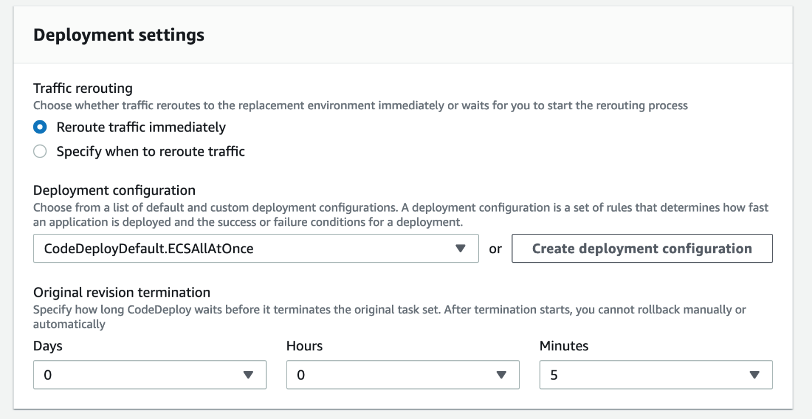

# Deployment Configuration

This section covers creating application deployment specifications and CodeDeploy configuration for Blue/Green deployments.

## Application Specification (AppSpec)

The AppSpec file defines how AWS CodeDeploy manages deployments as lifecycle event hooks.

### Create appspec.yaml

1. Create the AppSpec file:
   ```bash
   touch /Workshop/workshop-repo/appspec.yaml
   ```

2. Add the following content (keep `<TASK_DEFINITION>` as placeholder):

```yaml
version: 0.0
Resources:
  - TargetService:
      Type: AWS::ECS::Service
      Properties:
        TaskDefinition: "<TASK_DEFINITION>"
        LoadBalancerInfo:
          ContainerName: "webapp"
          ContainerPort: 80
```

**Important**: Do NOT replace `<TASK_DEFINITION>` - CodeDeploy will dynamically update this value with each new container image revision.

### AppSpec Configuration Details

- **TaskDefinition**: Placeholder for dynamic task definition updates
- **ContainerName**: The container name being updated (`webapp`)
- **ContainerPort**: Container port for load balancer routing (80)

### Advanced AppSpec Features

For more complex deployments, you can use AppSpec hooks to:
- Execute functions during different deployment stages
- Stop tasks before deployment
- Perform validations before traffic shifting
- Execute post-deployment validations

### Commit AppSpec

```bash
cd /Workshop/workshop-repo
git add appspec.yaml
git commit -m "Adding AppSpec"
git push -u origin main
```

## Task Definition Configuration

### Export Current Task Definition

Extract the existing ECS task definition for deployment configuration:

```bash
export TASK_DEFINITION=$(aws ecs list-task-definitions | jq -r '.taskDefinitionArns[0]')

aws ecs describe-task-definition --task-definition $TASK_DEFINITION \
  --query "taskDefinition.{family:family, taskRoleArn:taskRoleArn, executionRoleArn:executionRoleArn, networkMode:networkMode, containerDefinitions:containerDefinitions, volumes:volumes, placementConstraints:placementConstraints, requiresCompatibilities:requiresCompatibilities, cpu:cpu, memory:memory, tags:tags, pidMode:pidMode, ipcMode:ipcMode, proxyConfiguration:proxyConfiguration}" | \
  jq 'del(.[] | nulls)' > taskdef.json
```

### Update Task Definition

Modify the `taskdef.json` file to use a placeholder for the container image:

**Change this line:**
```json
"image": "<accountID>.dkr.ecr.us-east-1.amazonaws.com/devops-workshop-app:latest",
```

**To this:**
```json
"image": "<IMAGE1_NAME>",
```

This placeholder allows CodeDeploy to dynamically update the image URI for each deployment.

### Commit Task Definition

```bash
git add taskdef.json
git commit -m "Adding TaskDef"
git push -u origin main
```

## CodeDeploy Application Setup

### Create CodeDeploy Application

1. Go to [AWS CodeDeploy Console](https://console.aws.amazon.com/codesuite/codedeploy/)
2. Click **Create application**
3. Configure application:
   - **Application name**: `devops-workshop-MyWebApp`
   - **Compute platform**: Amazon ECS
4. Click **Create application**

### Create Deployment Group

1. Click **Create deployment group**
2. Configure deployment group:
   - **Deployment group name**: `devops-workshop-webapp-dg`
   - **Service role**: Select the CodeDeploy role created earlier
   
3. **Environment configuration**:
   - **ECS cluster name**: `ecs-devops-workshop`
   - **ECS service name**: `devops-cluster-Service-XXXXXXX` (webapp-svc)

4. **Load balancers**:
   - **Load balancer**: `alb-devops-workshop`
   - **Production listener port**: HTTP: 80
   - **Target group 1 name**: `ecs-devops-webapp-TG`
   - **Target group 2 name**: `ecs-devops-webapp-TG-tmp`

5. **Deployment settings**:
   - Leave **Reroute traffic immediately** selected
   - Change **Original revision termination** from 1 hour to **5 minutes** (for workshop purposes)



6. Click **Create deployment group**

## Deployment Strategy: Blue/Green

The configuration implements Blue/Green deployment with the following characteristics:

### Traffic Shifting
- **Linear 10% every 1 minute**: Traffic gradually shifts from old to new version
- **Two task sets**: One running old version, one running new version
- **Load balancer**: Routes traffic between task sets based on configuration

### Benefits
- **Zero downtime**: New version is fully tested before receiving traffic
- **Easy rollback**: Can quickly revert to previous version
- **Validation**: Time to perform manual testing during traffic shift
- **Risk reduction**: Gradual traffic migration reduces impact of issues

### Alternative: Rolling Deployment

For comparison, rolling deployment:
- Replaces containers one-by-one
- Faster than Blue/Green
- No environment isolation
- Higher risk, more complex rollback

## Repository Status

Your repository now contains all deployment configuration files:
- `appspec.yaml` - Deployment specification
- `taskdef.json` - ECS task definition template
- `buildspec.yml` - Build specification
- `Dockerfile` - Container definition

## Next Steps

Your deployment configuration is complete. You've set up:
1. AppSpec file for CodeDeploy lifecycle management
2. Task definition template for container deployment
3. CodeDeploy application and deployment group
4. Blue/Green deployment strategy

Proceed to [Pipeline Creation](05-pipeline-creation.md) to assemble the complete CI/CD pipeline.