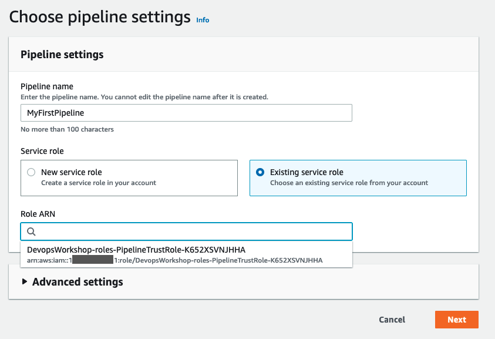
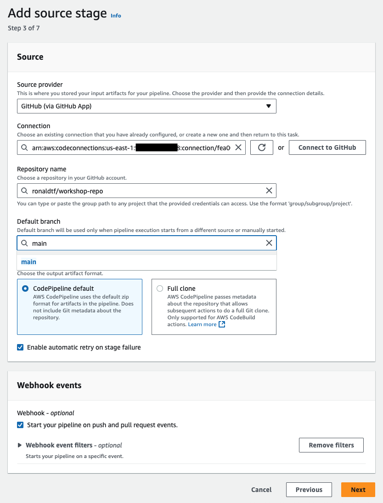
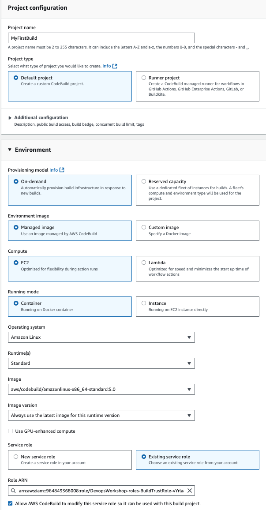
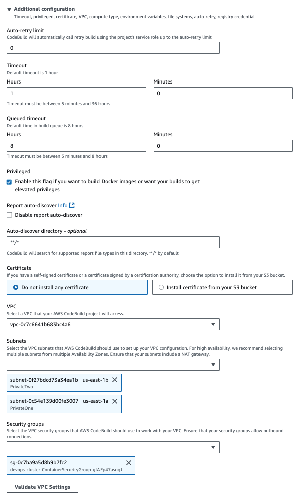
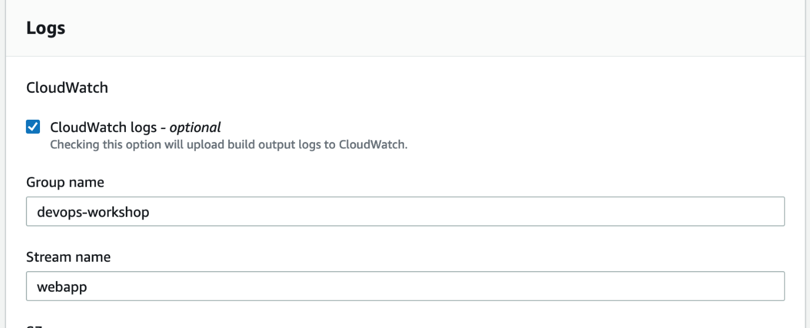
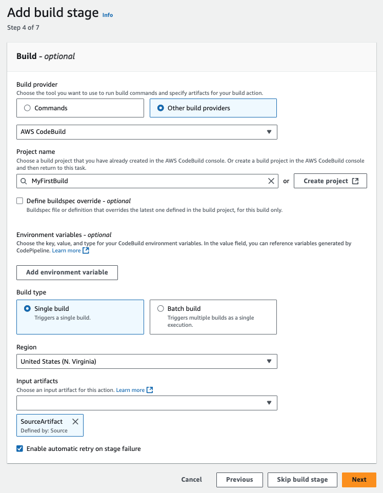
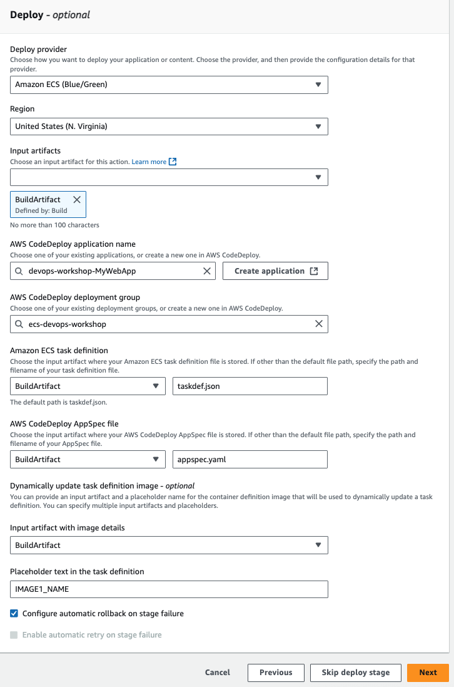

# Pipeline Creation

This section covers assembling the complete CI/CD pipeline using AWS CodePipeline to integrate source control, build, and deployment stages.

## Create CodePipeline

### Pipeline Settings

1. Go to [AWS CodePipeline Console](https://console.aws.amazon.com/codesuite/codepipeline/)
2. Click **Create Pipeline**
3. Configure pipeline settings:
   - **Creation option**: Build custom pipeline
   - **Pipeline name**: `MyFirstPipeline`
   - **Execution mode**: Queued (default)
   - **Service role**: Existing service role (select CodePipeline role created earlier)



4. Click **Next**

## Source Stage Configuration

Configure GitHub as the source provider:

- **Source provider**: GitHub (via GitHub App)
- **Connection**: Select the `github-connection` created earlier
- **Repository name**: `workshop-repo`
- **Branch name**: `main`
- Leave other settings as default



- Click **Next**

## Build Stage Configuration

### Create CodeBuild Project

1. **Build provider**: Other build providers → AWS CodeBuild
2. **Project name**: Click **Create project** (opens popup)

### Configure Build Project (in popup)

**Basic Configuration:**
- **Project name**: `MyFirstBuild`

**Environment:**
- **Provisioning model**: On-demand
- **Environment image**: Managed image
- **Compute**: EC2
- **Running mode**: Container
- **Operating system**: Amazon Linux
- **Runtime(s)**: Standard
- **Image**: `aws/codebuild/amazonlinux2-x86_64-standard:5.0`
- **Image version**: Always use the latest image for this runtime version

**Service Role:**
- **Service role**: Existing service role (select CodeBuild role created earlier)
- Keep **Allow AWS CodeBuild to modify this service role** checked

**Additional Configuration:**
- **Privileged**: Enable (required for building Docker images)

**VPC Configuration:**
- **VPC**: Select the VPC tagged as `devops-cluster` (not default)
- **Subnets**: Select `PrivateOne` and `PrivateTwo`
- **Security groups**: Select the Container security group

**BuildSpec:**
- **Build specification**: Use a buildspec file
- **Buildspec name**: `buildspec.yml` (default)

**Logs:**
- **CloudWatch Logs**: Enabled
- **Group name**: `devops-workshop`
- **Stream name**: `webapp`







3. Click **Continue to CodePipeline**
4. Project name will be populated automatically



5. Click **Next**

## Skip Test Stage

Click **Next** → **Skip deploy stage** to proceed directly to deployment configuration.

## Deploy Stage Configuration

Configure Blue/Green deployment:

- **Deploy provider**: Amazon ECS (Blue/Green)
- **Region**: Ensure correct region is selected
- **AWS CodeDeploy application name**: `devops-workshop-MyWebApp`
- **AWS CodeDeploy deployment group**: `devops-workshop-webapp-dg`

**Artifact Configuration:**
- **Amazon ECS task definition**: 
  - **Input artifacts**: BuildArtifact
  - **File name**: `taskdef.json`
- **AWS CodeDeploy AppSpec file**:
  - **Input artifacts**: BuildArtifact  
  - **File name**: `appspec.yaml`
- **Dynamically update task definition image**:
  - **Input artifacts**: BuildArtifact
  - **Placeholder text in task definition**: `IMAGE1_NAME`



Click **Next**

## Review and Create

1. Review all pipeline configuration
2. Click **Create pipeline**
3. **Important**: When pipeline starts automatically, click **Stop execution** → **Stop and Abandon** to prevent initial run

## Pipeline Architecture

Your completed pipeline includes:

### Source Stage
- **Trigger**: Code changes pushed to GitHub main branch
- **Output**: Source code artifacts
- **Integration**: GitHub App connection for secure access

### Build Stage  
- **Input**: Source code from GitHub
- **Process**: 
  - Docker image build using Dockerfile
  - Push to Amazon ECR with multiple tags (latest + build ID)
  - Generate deployment artifacts (imageDetail.json, appspec.yaml, taskdef.json)
- **Output**: Build artifacts for deployment

### Deploy Stage
- **Input**: Build artifacts
- **Process**:
  - Create new ECS task definition with updated container image
  - Deploy new task set alongside existing tasks
  - Gradually shift traffic using Blue/Green strategy (10% every minute)
  - Monitor deployment health
- **Output**: Updated application deployment

## Pipeline Flow

```
GitHub Push → CodePipeline Trigger → CodeBuild → ECR Push → CodeDeploy → ECS Update
```

1. **Code Commit**: Developer pushes code to GitHub
2. **Pipeline Trigger**: CodePipeline detects change and starts execution
3. **Build**: CodeBuild creates container image and pushes to ECR
4. **Deploy**: CodeDeploy creates new task set and shifts traffic gradually
5. **Validation**: Monitor application during traffic shift
6. **Completion**: Old tasks terminated after successful deployment

## Monitoring and Logs

**Pipeline Monitoring:**
- CodePipeline console shows stage-by-stage progress
- Each stage provides detailed logs and status

**Build Logs:**
- CloudWatch Logs: `devops-workshop/webapp`
- Real-time build output and error details

**Deployment Monitoring:**
- CodeDeploy console shows deployment progress
- ECS console displays task set transitions
- Application Load Balancer shows target group health

## Next Steps

Your CI/CD pipeline is now complete and ready for testing. The pipeline will:
1. Automatically trigger on code changes
2. Build and containerize your application  
3. Deploy using Blue/Green strategy with gradual traffic shifting
4. Provide monitoring and rollback capabilities

Proceed to [Testing Pipeline](06-testing-pipeline.md) to make code changes and validate the complete workflow.