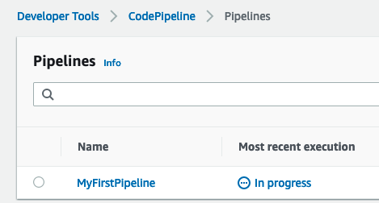
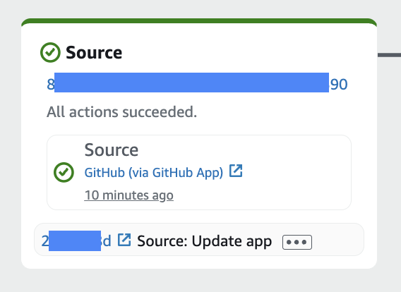
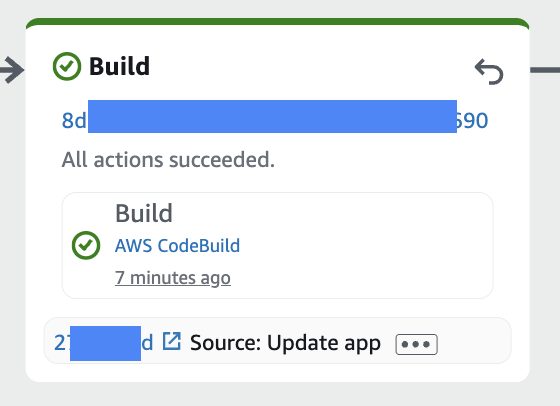
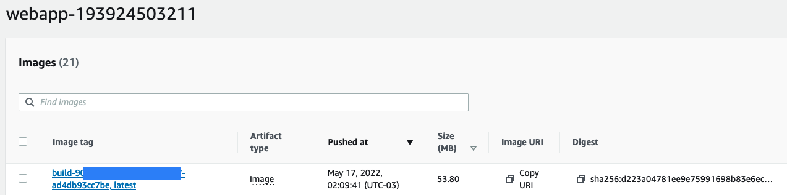
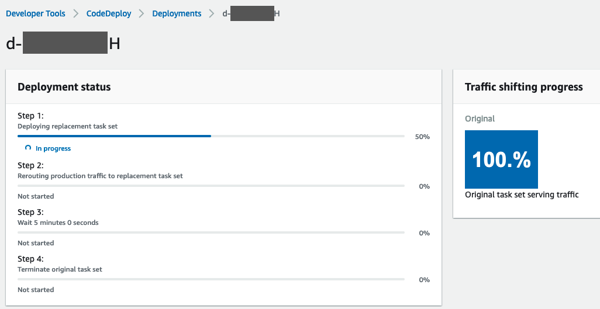
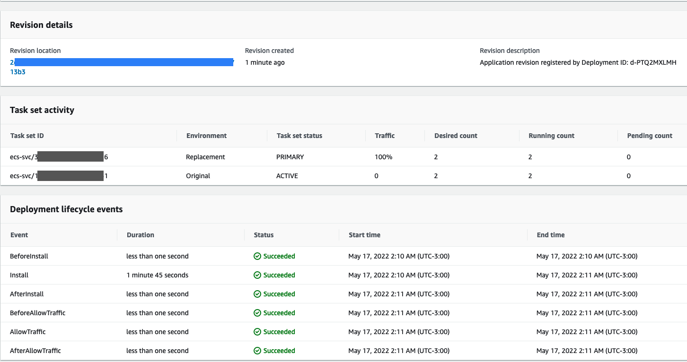
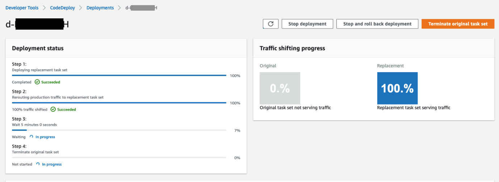
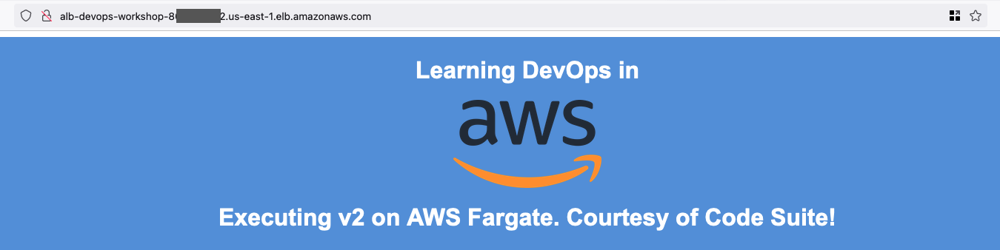

# Testing Pipeline

This section covers testing the complete CI/CD pipeline by making code changes and monitoring the automated deployment process.

## Update Application Code

Let's modify the web application to test the pipeline end-to-end.

### Make Code Changes

1. Open `index.html` in VS Code
2. Locate line 21 and change:

**From:**
```html
<h1><strong>Executing v1 on AWS Fargate</strong></h1>
```

**To:**
```html
<h1><strong>Executing v2 on AWS Fargate. Courtesy of Code Suite!</strong></h1>
```

### Commit and Push Changes

```bash
cd /Workshop/workshop-repo
git add index.html
git commit -m "Updated Web App to v2"
git push -u origin main
```

## Monitor Pipeline Execution

### Pipeline Trigger

1. Go to CodePipeline console
2. Open `MyFirstPipeline`
3. The pipeline should automatically start executing after detecting the GitHub push



### Stage-by-Stage Monitoring

## Source Stage

**What happens:**
- CodePipeline detects the GitHub commit
- Downloads source code artifacts
- Displays commit ID and commit message

**Monitoring:**
- View commit details in Source stage
- Verify correct branch and commit hash



## Build Stage  

**What happens:**
- CodeBuild executes buildspec.yml commands
- Builds Docker container image
- Pushes to Amazon ECR with multiple tags
- Generates deployment artifacts

**Monitoring:**
- Click **Details** to view real-time build logs
- Monitor Docker build process
- Verify ECR image push success



**Build Log Highlights:**
```
Phase: PRE_BUILD
- ECR login successful
- Commit hash extracted
- Build ID generated

Phase: BUILD  
- Docker image build started
- Image tagged with latest and build ID

Phase: POST_BUILD
- Images pushed to ECR
- Artifacts generated (imageDetail.json, appspec.yaml, taskdef.json)
```

### Verify ECR Repository

Check Amazon ECR console:
- Navigate to `devops-workshop-app` repository
- Verify two image tags:
  - `latest` - Most recent build
  - `build-[BUILD_ID]` - Specific build identifier



## Deploy Stage

**What happens:**
- CodeDeploy creates new ECS task definition
- Launches new task set with updated container image
- Gradually shifts traffic from old to new tasks (10% every minute)
- Monitors deployment health

**Monitoring:**
- Click **Details** in Deploy stage to open CodeDeploy console
- Monitor deployment progress in real-time

### Deployment Process Stages

**1. Task Set Creation:**
- New task definition version created
- New tasks launched with updated container image
- Tasks pass health checks

**2. Traffic Shifting:**
- Application Load Balancer begins routing traffic
- Traffic shifts incrementally (10% every minute)
- Both old and new versions serve traffic simultaneously

**3. Deployment Completion:**
- All traffic routed to new tasks
- 5-minute timer for manual validation (configurable)
- Old tasks terminated after successful validation







### CodeDeploy Console Monitoring

**Deployment Dashboard shows:**
- Current deployment status
- Traffic shifting progress
- Task health status
- Rollback options if needed

**Key Metrics:**
- Deployment duration
- Traffic distribution percentages
- Task replacement progress
- Health check results

## Validate Application Updates

### Access Updated Application

1. Go to CloudFormation Outputs tab
2. Click on `ExternalUrl` link  
3. Verify the updated text appears:
   > "Executing v2 on AWS Fargate. Courtesy of Code Suite!"



### Deployment Verification

**Application Level:**
- New version displays correctly
- Application functionality unchanged
- No service interruption during deployment

**Infrastructure Level:**
- ECS service shows updated task definition
- Load balancer targets are healthy
- New container image deployed successfully

## Pipeline Execution Summary

**End-to-End Flow Completed:**
1. ✅ Code pushed to GitHub
2. ✅ Pipeline automatically triggered
3. ✅ Source code downloaded
4. ✅ Docker image built and pushed to ECR
5. ✅ Blue/Green deployment executed
6. ✅ Traffic gradually shifted to new version
7. ✅ Application updated without downtime
8. ✅ Old tasks cleaned up

## Troubleshooting Common Issues

### Build Stage Failures
- Check CloudWatch Logs for detailed error messages
- Verify Docker build commands in buildspec.yml
- Ensure ECR permissions are correctly configured

### Deployment Stage Failures
- Verify ECS service and cluster configuration
- Check Application Load Balancer target group health
- Review CodeDeploy deployment logs

### Application Access Issues
- Confirm security group rules allow HTTP traffic
- Verify load balancer listener configuration
- Check ECS task health status

## Optional: Test Rolling Deployment

For comparison, you can also test rolling deployment strategy:

### Create imagedefinitions.json

```bash
cd workshop-repo/
touch imagedefinitions.json
```

Add content:
```json
[
  {
    "name": "webapp", 
    "imageUri": "ACCOUNT_ID.dkr.ecr.us-east-1.amazonaws.com/devops-workshop-app"
  }
]
```

### Update Pipeline for Rolling Deployment

Modify the deploy stage to use Amazon ECS (not Blue/Green) for rolling updates.

## Next Steps

Congratulations! You have successfully:
- Implemented a complete CI/CD pipeline
- Tested automated deployments with Blue/Green strategy
- Validated zero-downtime application updates
- Monitored the entire deployment process

Your DevOps pipeline is now operational and ready for ongoing development workflows.

Proceed to [Cleanup](07-cleanup.md) when ready to remove workshop resources.